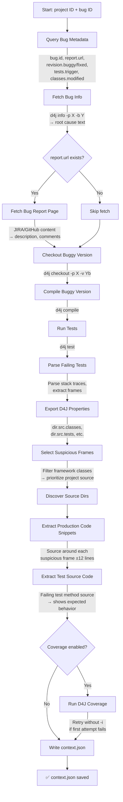
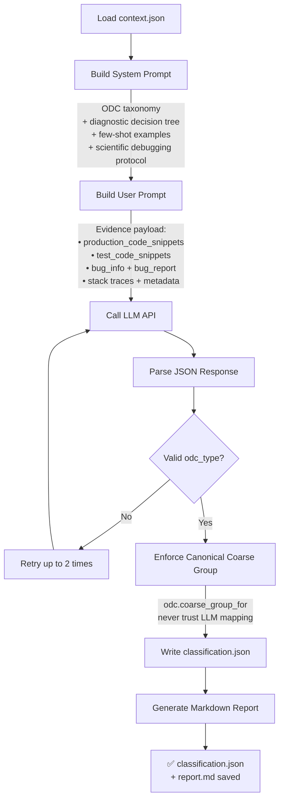
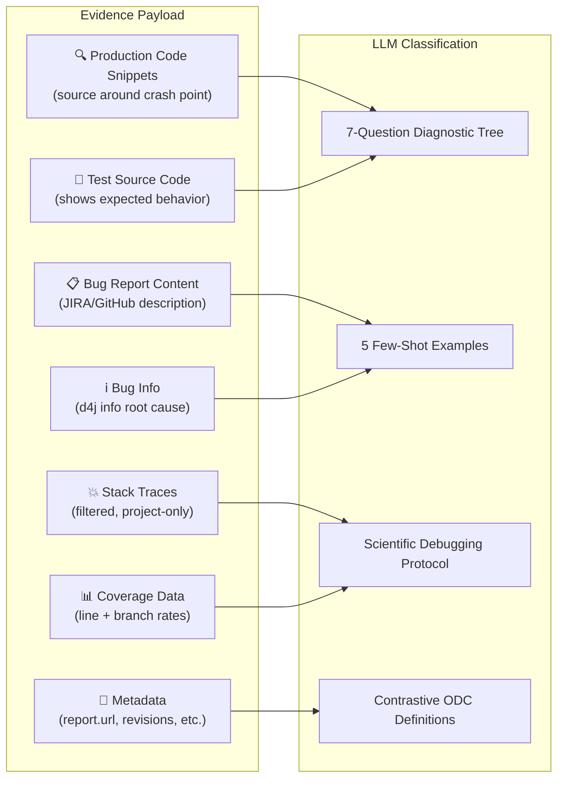

# Defects4J ODC Pipeline

A research pipeline that collects pre-fix bug evidence from [Defects4J](https://github.com/rjust/defects4j), classifies it into ODC (**Orthogonal Defect Classification**) defect types using an LLM (Gemini by default, OpenRouter as fallback), and saves machine-readable outputs for evaluation.

The pipeline follows a **Scientific Debugging** methodology — observation → hypothesis → prediction → experiment → conclusion — to classify each bug into one of 7 ODC defect types with grounded, code-level reasoning.

---

## Pipeline Architecture

### Evidence Collection Flow (`collect`)



### Classification Flow (`classify`)



### Evidence Sent to LLM



---

## What the pipeline does

1. **Queries bug metadata** — `report.url`, `revision.buggy`, `revision.fixed`, `tests.trigger`, `classes.modified` (hidden oracle), etc.
2. **Fetches bug info** — Runs `defects4j info` to capture root cause text and triggering tests.
3. **Fetches bug report page** — Downloads and parses JIRA/GitHub bug report content for natural language descriptions.
4. **Checks out and compiles the buggy version** — `defects4j checkout` + `defects4j compile`.
5. **Runs tests and parses failures** — Parses `failing_tests` file and extracts structured stack frames.
6. **Filters suspicious frames** — Removes JUnit, Ant, JDK, Hamcrest, Mockito, and 20+ other framework classes. Prioritizes project source frames.
7. **Extracts production code snippets** — Reads Java source around each suspicious frame (±12 lines).
8. **Extracts test source code** — Reads the failing test method source to show expected behavior.
9. **Runs targeted coverage** (optional) — Instruments only suspicious classes, retries on failure.
10. **Classifies using LLM** — Sends structured evidence to Gemini/OpenRouter with a scientific debugging prompt containing:
    - Contrastive ODC definitions with boundary rules
    - 5 canonical few-shot examples
    - 7-question diagnostic decision tree
    - Anti-bias rules preventing default-to-Function behavior
11. **Writes outputs** — `context.json`, `classification.json`, and a markdown report.

---

## ODC Defect Types

The pipeline classifies into 7 ODC **Defect Type** categories:

| ODC Type                 | Coarse Group     | Description                                     |
| ------------------------ | ---------------- | ----------------------------------------------- |
| **Function**             | Structural       | Missing capability never implemented at all     |
| **Interface**            | Structural       | Parameter/API contract mismatch between modules |
| **Build/Package/Merge**  | Structural       | Build scripts, config, dependency issues        |
| **Checking**             | Control and Data | Missing/incorrect validation or guard           |
| **Assignment**           | Control and Data | Wrong value, wrong variable, wrong constant     |
| **Algorithm**            | Control and Data | Incorrect computation or procedure logic        |
| **Timing/Serialization** | Control and Data | Race condition, ordering, or concurrency bug    |

---

## Setup

### 1. Windows prerequisites

- Python 3.11+
- WSL with Ubuntu
- Keep this repo on Windows; keep the Defects4J clone inside WSL on the Linux filesystem.

### 2. WSL prerequisites

```bash
sudo apt update
sudo apt install -y openjdk-11-jdk git subversion perl cpanminus curl unzip
git config --global core.autocrlf input
```

### 3. Clone and initialize Defects4J inside WSL

```bash
cd ~
git clone https://github.com/rjust/defects4j.git
cd defects4j
sudo cpanm --installdeps .
./init.sh
perl framework/bin/defects4j info -p Lang
```

If `info -p Lang` fails with a missing Perl module such as `String::Interpolate`:

```bash
sudo cpanm String::Interpolate
sudo cpanm --installdeps ~/defects4j
```

### 4. Create a Python virtual environment and install dependencies

```powershell
cd C:\path\to\your\repo\implementation

python -m venv .venv
.venv\Scripts\Activate.ps1          # PowerShell
# or: .venv\Scripts\activate.bat    # CMD

pip install -r requirements.txt
```

Or install as an editable package (adds the `d4j-odc` shortcut command):

```powershell
pip install -e .
```

### 5. Configure `.env`

Copy `.env.example` to `.env` and set your values:

```dotenv
DEFAULT_LLM_PROVIDER=gemini
DEFAULT_LLM_MODEL=gemini-3.1-flash-lite-preview
GEMINI_API_KEY=your_real_key_here
DEFECTS4J_CMD=wsl perl /home/your-linux-user/defects4j/framework/bin/defects4j
DEFECTS4J_PATH_STYLE=wsl
```

---

## Usage

### `collect` — Build pre-fix context

Checks out the buggy version, runs tests, fetches all evidence, and saves `context.json`.

```powershell
python -m d4j_odc_pipeline collect `
  --project Lang --bug 1 `
  --work-dir .\work\Lang_1b `
  --output .\artifacts\Lang_1\context.json `
  --skip-coverage
```

### `classify` — Classify an existing context

Sends evidence to the LLM and produces classification + report.

```powershell
python -m d4j_odc_pipeline classify `
  --context .\artifacts\Lang_1\context.json `
  --output .\artifacts\Lang_1\classification.json `
  --report .\artifacts\Lang_1\report.md
```

### `run` — End-to-end collection + classification

Runs both `collect` and `classify` in a single command.

```powershell
python -m d4j_odc_pipeline run `
  --project Lang --bug 1 `
  --work-dir .\work\Lang_1b `
  --context-output .\artifacts\Lang_1\context.json `
  --classification-output .\artifacts\Lang_1\classification.json `
  --report .\artifacts\Lang_1\report.md `
  --skip-coverage
```

### `d4j` — Defects4J proxy commands

Convenience wrappers around common Defects4J operations with formatted output:

```powershell
python -m d4j_odc_pipeline d4j pids                         # List all projects
python -m d4j_odc_pipeline d4j bids --project Lang           # List bug IDs
python -m d4j_odc_pipeline d4j info --project Lang --bug 1   # Show bug details
```

### `compare` and `compare-batch` — Accuracy Evaluation

Compare pre-fix and post-fix classification results using multi-tier accuracy metrics:

```powershell
# Compare a single bug pair
python -m d4j_odc_pipeline compare `
  --prefix .\artifacts\Lang_1\classification.json `
  --postfix .\artifacts\Lang_1f\classification.json `
  --output .\artifacts\Lang_1\comparison.json

# Batch compare a directory of pairs
python -m d4j_odc_pipeline compare-batch `
  --prefix-dir .\artifacts\prefix_runs `
  --postfix-dir .\artifacts\postfix_runs `
  --output .\artifacts\batch_comparison.json `
  --report .\artifacts\accuracy_report.md
```

---

## CLI Parameters

### Common parameters (used by `collect`, `run`)

| Parameter            | Required | Description                                               |
| -------------------- | :------: | --------------------------------------------------------- |
| `--project`          |   Yes    | Defects4J project id (`Lang`, `Math`, `Chart`, etc.)      |
| `--bug`              |   Yes    | Numeric bug id. Automatically suffixed to `<bug>b`.       |
| `--work-dir`         |   Yes    | Checkout directory for the buggy revision.                |
| `--defects4j-cmd`    |    No    | Override `DEFECTS4J_CMD` for this run.                    |
| `--snippet-radius`   |    No    | Source lines around suspicious frames. Default: `12`.     |
| `--skip-coverage`    |    No    | Skip the `defects4j coverage` step.                       |
| `--include-fix-diff` |    No    | Include buggy->fixed diff as post-fix oracle (see below). |

### LLM parameters (used by `classify`, `run`)

| Parameter                              | Required | Description                                          |
| -------------------------------------- | :------: | ---------------------------------------------------- |
| `--context`                            |  Yes\*   | Path to existing `context.json`. (_`classify` only_) |
| `--output` / `--classification-output` |   Yes    | Path for classification JSON.                        |
| `--report`                             |   No†    | Markdown report path. (†Required in `run`.)          |
| `--prompt-output`                      |    No    | Save rendered prompt messages as JSON.               |
| `--prompt-style`                       |    No    | `direct` or `scientific` (default: `scientific`).    |
| `--provider`                           |    No    | `gemini`, `openrouter`, or `openai-compatible`.      |
| `--model`                              |    No    | Model name for the selected provider.                |
| `--api-key-env`                        |    No    | Custom env var name for the API key.                 |
| `--base-url`                           |    No    | Override API base URL.                               |
| `--dry-run`                            |    No    | Build prompt only, skip LLM call.                    |

### Comparison parameters (used by `compare`, `compare-batch`)

| Parameter       | Required | Description                                         |
| --------------- | :------: | --------------------------------------------------- |
| `--prefix`      |  Yes\*   | Path to pre-fix JSON. (_`compare` only_)            |
| `--postfix`     |  Yes\*   | Path to post-fix JSON. (_`compare` only_)           |
| `--prefix-dir`  |   Yes†   | Directory of pre-fix runs. (†`compare-batch` only)  |
| `--postfix-dir` |   Yes†   | Directory of post-fix runs. (†`compare-batch` only) |
| `--output`      |   Yes    | Path for comparison JSON output.                    |
| `--report`      |    No    | Path for human-readable markdown report.            |

### Global flags

| Flag             | Description                                          |
| ---------------- | ---------------------------------------------------- |
| `-q` / `--quiet` | Suppress all rich console output (for scripting/CI). |

---

## Coverage Mode

Coverage is optional and adds line/branch-level evidence to the context.

- **With `--skip-coverage`**: Faster, simpler. Best for first runs, setup debugging, or fast batch collection.
- **Without `--skip-coverage`**: Instruments suspicious classes, runs coverage with the first failing test, and parses Cobertura XML. If the first attempt fails (e.g., Cobertura instrumentation crash), the pipeline **automatically retries without the instrument file**. If no suspicious source frames exist, coverage is skipped automatically.

**Recommendation**: Use `--skip-coverage` until checkout/compile/test/classify are working, then remove it.

---

## Fix Diff Mode (Post-Fix Oracle)

By default, the pipeline only uses **pre-fix evidence** — the LLM never sees the actual fix. This simulates real-world bug triage.

With `--include-fix-diff`, the pipeline also:

1. Checks out the **fixed version** (`<bug>f`) in a temporary directory
2. Diffs the modified classes between buggy and fixed versions
3. Includes the unified diff in the LLM evidence as a **post-fix oracle**
4. Cleans up the fixed checkout automatically

### Comparing Pre-fix vs Post-fix Accuracy

For thesis evaluation, you can compare classification accuracy by running each bug **twice**:

```powershell
# Step 1: Collect pre-fix context (no diff)
python -m d4j_odc_pipeline collect `
  --project Lang --bug 1 `
  --work-dir .\work\Lang_1b `
  --output .\artifacts\Lang_1\context.json `
  --skip-coverage

# Step 2: Collect post-fix context (with diff)
python -m d4j_odc_pipeline collect `
  --project Lang --bug 1 `
  --work-dir .\work\Lang_1b_fix `
  --output .\artifacts\Lang_1f\context.json `
  --skip-coverage --include-fix-diff

# Step 3: Classify both (reuse existing context — instant, no checkout needed)
python -m d4j_odc_pipeline classify `
  --context .\artifacts\Lang_1\context.json `
  --output .\artifacts\Lang_1\classification.json `
  --report .\artifacts\Lang_1\report.md

python -m d4j_odc_pipeline classify `
  --context .\artifacts\Lang_1f\context.json `
  --output .\artifacts\Lang_1f\classification.json `
  --report .\artifacts\Lang_1f\report.md
```

Both `classification.json` and `report.md` include an **`evidence_mode`** field (`"pre-fix"` or `"post-fix"`) so you can programmatically compare results. Reports also display this prominently with a ✅ or ⚠️ badge.

> **Note**: The fix diff is clearly labeled in the prompt as "POST-FIX oracle information" so the LLM knows it wouldn't normally be available. The `classes.modified` field remains hidden from the prompt regardless.

## Output Files

| File                     | Produced by        | Contents                                            |
| ------------------------ | ------------------ | --------------------------------------------------- |
| `context.json`           | `collect` / `run`  | All pre-fix evidence (code, tests, bug report, etc) |
| `classification.json`    | `classify` / `run` | ODC classification with reasoning chain             |
| `report.md`              | `classify` / `run` | Human-readable bug + classification summary         |
| `prompt.json`            | `--prompt-output`  | Rendered prompt messages sent to the LLM            |
| `instrument_classes.txt` | Coverage step      | Classes instrumented for coverage                   |

---

## Provider Options

| Provider            | Default key env var  | Default base URL                                   |
| ------------------- | -------------------- | -------------------------------------------------- |
| `gemini`            | `GEMINI_API_KEY`     | `https://generativelanguage.googleapis.com/v1beta` |
| `openrouter`        | `OPENROUTER_API_KEY` | `https://openrouter.ai/api/v1`                     |
| `openai-compatible` | `OPENAI_API_KEY`     | `https://api.openai.com/v1`                        |

OpenRouter example:

```dotenv
DEFAULT_LLM_PROVIDER=openrouter
DEFAULT_LLM_MODEL=openai/gpt-5.2
OPENROUTER_API_KEY=your_key_here
OPENROUTER_BASE_URL=https://openrouter.ai/api/v1
OPENROUTER_HTTP_REFERER=https://your-site.example
OPENROUTER_APP_TITLE=Defects4J ODC Pipeline
```

---

## Project Structure

```bash
d4j_odc_pipeline/
├── __main__.py        # CLI entry point (argparse commands)
├── pipeline.py        # Core collect + classify orchestration
├── defects4j.py       # Defects4J client (checkout, test, query, coverage)
├── llm.py             # LLM API client (Gemini, OpenRouter, OpenAI-compatible)
├── prompting.py       # Prompt engineering (ODC taxonomy, few-shot examples, decision tree)
├── odc.py             # ODC type definitions with contrastive boundary rules
├── models.py          # Data models (BugContext, ClassificationResult, etc.)
├── parsing.py         # Stack trace parser, JSON extraction
├── console.py         # Rich terminal output helpers
└── reporting.py       # Markdown report generator
```

---

## Design Choices

- The LLM sees **pre-fix evidence only** by default.
- `classes.modified` is stored as a hidden oracle for offline analysis but excluded from the prompt.
- The default prompt style is `scientific`, following observation → hypothesis → prediction → experiment → conclusion.
- The ODC target is the 7-class **Defect Type** attribute.
- Evidence is separated into `production_code_snippets` and `test_code_snippets` so the LLM distinguishes "where the bug is" from "what behavior is expected."
- Framework classes (JUnit, Ant, JDK, Hamcrest, Mockito, etc.) are aggressively filtered to ensure only project source frames reach the LLM.
- Bug report content is fetched from JIRA/GitHub and truncated to 6,000 chars to avoid prompt explosion.
- Defects4J runs through WSL; Windows paths are converted automatically when `DEFECTS4J_PATH_STYLE=wsl`.

---

## Official References

- [Defects4J CLI overview](https://defects4j.org/html_doc/defects4j.html)
- [Defects4J docs index](https://defects4j.org/html_doc/index.html)
- [d4j-checkout](https://defects4j.org/html_doc/d4j/d4j-checkout.html) · [d4j-compile](https://defects4j.org/html_doc/d4j/d4j-compile.html) · [d4j-test](https://defects4j.org/html_doc/d4j/d4j-test.html) · [d4j-coverage](https://defects4j.org/html_doc/d4j/d4j-coverage.html)
- [d4j-export](https://defects4j.org/html_doc/d4j/d4j-export.html) · [d4j-query](https://defects4j.org/html_doc/d4j/d4j-query.html) · [d4j-bids](https://defects4j.org/html_doc/d4j/d4j-bids.html) · [d4j-info](https://defects4j.org/html_doc/d4j/d4j-info.html) · [d4j-pids](https://defects4j.org/html_doc/d4j/d4j-pids.html)
