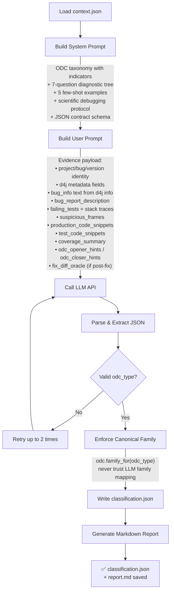
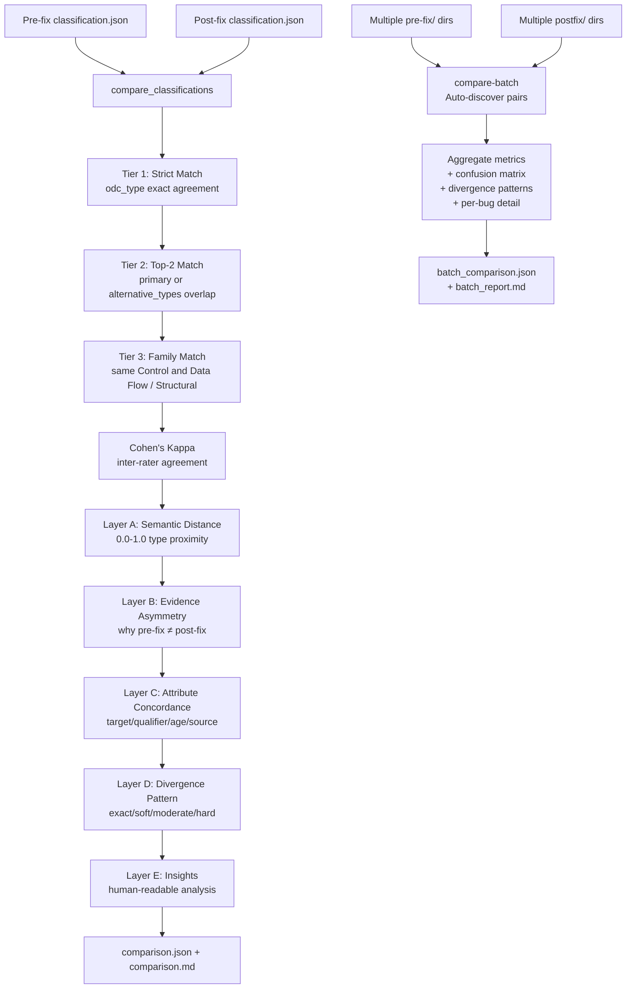

# Architecture & Technical Reference

This document describes the pipeline's internal architecture, evidence flows, ODC taxonomy, and schema contracts.

---

## Pipeline Architecture

### Evidence Collection Flow (`collect`)

```mermaid
flowchart TD
    A[Start: project ID + bug ID] --> B[d4j query: bug metadata]
    B --> |"bug.id, report.id, report.url,\nrevision.buggy, revision.fixed,\nclasses.modified, classes.relevant,\ntests.trigger, tests.relevant"| C[d4j info: bug root cause text]
    C --> D{report.url exists?}
    D -->|Yes| E[Fetch Bug Report Page\nGitHub API / JIRA API / generic HTML]
    D -->|No| F[Skip fetch]
    E --> |"title, type, priority, description,\ncomments → bug_report_content"| G[d4j checkout buggy version]
    F --> G
    G --> |"d4j checkout -p X -v Yb\n→ buggy source on disk"| H[d4j compile]
    H --> |"d4j compile -w <work_dir>"| I[d4j test]
    I --> |"d4j test -w <work_dir>"| J[Parse Failing Tests]
    J --> |"failing_tests file + stderr\n→ test_name, headline, stack_trace, frames"| K[d4j export properties]
    K --> |"dir.src.classes, dir.bin.classes,\ndir.src.tests, dir.bin.tests,\ncp.compile, cp.test,\ntests.trigger, tests.relevant"| L[Select Suspicious Frames]
    L --> |"Filter framework classes\n→ prioritize project source\n→ max 12 source frames"| M[Discover Source Dirs]
    M --> N[Extract Production Code Snippets]
    N --> |"Source around each suspicious frame\n±12 lines, with focus-line marker"| O[Extract Test Source Code]
    O --> |"Failing test method source\n±18 lines, shows expected behavior"| P{Coverage enabled?}
    P -->|Yes| Q[d4j coverage on suspicious classes]
    P -->|No| R[Build BugContext]
    Q --> |"Cobertura XML → line_rate,\nbranch_rate, covered_lines"| R
    R --> S{--include-fix-diff?}
    S -->|Yes| T[Checkout fixed version\nDiff modified classes → fix_diff]
    S -->|No| U[Write context.json]
    T --> U
    U --> V["✅ context.json saved"]
```



### Classification Flow (`classify`)



### Accuracy Evaluation Flow (`compare` / `compare-batch`)



---

## Defects4J Artifacts & Metadata Used as LLM Input

This section describes every data item that originates from the Defects4J dataset (its CLI tools, property files, and checked-out source) and how it flows into the LLM context.

### From `defects4j query` (via `query_bug_metadata`)

The pipeline queries the following fields for every bug using `defects4j query -p <project> -q <fields>`:

| Field              | D4J CLI field name | Role in LLM input                                                                   |
| ------------------ | ------------------ | ----------------------------------------------------------------------------------- |
| Bug ID             | `bug.id`           | Identity metadata sent in `project_id` / `bug_id` / `version_id`                    |
| Report tracking ID | `report.id`        | Included in `metadata` payload (e.g. `LANG-747`)                                    |
| Bug report URL     | `report.url`       | Used to fetch `bug_report_content` from JIRA/GitHub; URL itself kept in `metadata`  |
| Buggy commit hash  | `revision.buggy`   | Stored in `metadata`; identifies which version was checked out                      |
| Fixed commit hash  | `revision.fixed`   | Stored in `metadata`; used only when `--include-fix-diff` is set                    |
| Modified classes   | `classes.modified` | **Hidden oracle** — stored in `hidden_oracles`, excluded from LLM prompt by default |
| Relevant classes   | `classes.relevant` | Stored in `metadata` for reference                                                  |
| Triggering tests   | `tests.trigger`    | Stored in `metadata`; cross-referenced with parsed failures                         |
| Relevant tests     | `tests.relevant`   | Stored in `metadata`                                                                |

> **Note**: `classes.modified` is the ground-truth oracle. It is never sent to the LLM in pre-fix mode to avoid data leakage.

### From `defects4j info` (via `client.info`)

The pipeline runs `defects4j info -p <project> -b <id>` and captures its full stdout as `bug_info`. This text contains:

- Project summary (script dir, base dir, repo, etc.)
- Number of bugs in the project
- Fixed revision ID and date
- Bug report ID and URL
- **Root cause in triggering tests** (the exception + test name mapping)
- List of modified source files

This `bug_info` text is sent verbatim as `bug_info` in the user prompt evidence payload.

### From `defects4j checkout` + `defects4j compile` + `defects4j test`

| Operation | D4J command                                   | What it produces                                                  |
| --------- | --------------------------------------------- | ----------------------------------------------------------------- |
| Checkout  | `defects4j checkout -p X -v Yb -w <work_dir>` | Buggy source tree on disk; `work_dir` recorded in context         |
| Compile   | `defects4j compile -w <work_dir>`             | Validates the buggy version compiles; exit code stored in `notes` |
| Test      | `defects4j test -w <work_dir>`                | Generates `failing_tests` file; creates test failure output       |

**From `defects4j test` output** (parsed by `read_failures` + `parse_failing_tests`):

- `test_name` — fully qualified test method (e.g. `org.foo.BarTest::testMethod`)
- `test_class` / `test_method` — split from test name
- `headline` — exception class + message from the first line of the failure block
- `stack_trace` — raw stack trace lines (first 15 lines sent to LLM per failure)
- `frames` — parsed structured frames: `class_name`, `method_name`, `file_name`, `line_number`

The **suspicious frames** are selected from these parsed frames by filtering out framework/JDK/build-tool classes (`org.junit.*`, `java.*`, `org.apache.tools.ant.*`, etc.) and preferring project source frames (up to 12).

### From `defects4j export` (via `export_properties`)

After checkout, the pipeline runs `defects4j export -p <property> -w <work_dir>` for each of:

| Export property   | Usage                                                              |
| ----------------- | ------------------------------------------------------------------ |
| `dir.src.classes` | Locates production Java source root(s) for code snippet extraction |
| `dir.bin.classes` | Stored in `exports` for reference                                  |
| `dir.src.tests`   | Locates test Java source root(s) for test snippet extraction       |
| `dir.bin.tests`   | Stored in `exports` for reference                                  |
| `cp.compile`      | Stored in `exports` for reference                                  |
| `cp.test`         | Stored in `exports` for reference                                  |
| `tests.trigger`   | Cross-referenced with failing test output                          |
| `tests.relevant`  | Stored in `exports` for reference                                  |

`dir.src.classes` and `dir.src.tests` are the most critical — they are used to resolve Java source files from stack frame class names, enabling production and test code snippet extraction.

### From the Checked-Out Source Tree

Using the directory paths from `defects4j export`, the pipeline reads Java source files directly:

| Artifact                     | How collected                                                                              | Sent to LLM as               |
| ---------------------------- | ------------------------------------------------------------------------------------------ | ---------------------------- |
| **Production code snippets** | Source file around each suspicious frame (±12 lines), focus-line marked with `>>`          | `production_code_snippets[]` |
| **Test source code**         | The failing test method body from the test source file (±18 lines, or exact method bounds) | `test_code_snippets[]`       |

Each code snippet carries:

- `class_name`, `file_path`, `start_line`, `end_line`, `focus_line`
- `reason` — why this snippet was selected (e.g. "Stack frame from Foo.bar" or "Test source: BarTest::testFoo")
- `content` — the actual lines with line numbers

### From `defects4j coverage` (optional, `--skip-coverage` to disable)

When coverage is enabled, the pipeline runs `defects4j coverage -w <work_dir> [-t <test>] [-i <instrument_file>]`. It parses the resulting Cobertura XML reports (`coverage*.xml`, `cobertura*.xml`) to extract per-class coverage data:

| Coverage field  | Sent to LLM as                                     |
| --------------- | -------------------------------------------------- |
| `class_name`    | Identifier in `coverage_summary[]`                 |
| `line_rate`     | Fraction of executed lines (0.0–1.0)               |
| `branch_rate`   | Fraction of executed branches (0.0–1.0)            |
| `covered_lines` | Top-10 hit lines per class (`line_number`, `hits`) |

Coverage is focused on the **suspicious classes** (those appearing in selected stack frames) to avoid noisy irrelevant data.

### From JIRA / GitHub (via `web_fetch`)

Bug report URLs (from `report.url`) are fetched and the content extracted:

| Source type   | Extraction method                                         | Fields extracted                                                                              |
| ------------- | --------------------------------------------------------- | --------------------------------------------------------------------------------------------- |
| Apache JIRA   | JIRA REST API (`/rest/api/2/issue/{key}`)                 | `summary`, `description`, `issuetype`, `priority`, `status`, `resolution`, up to 5 `comments` |
| GitHub Issues | GitHub REST API (`/repos/{owner}/{repo}/issues/{number}`) | `title`, `state`, `labels`, `body`, up to 5 `comments`                                        |
| Generic HTML  | HTML → text stripping pipeline                            | Full page text, whitespace-collapsed                                                          |

The result is truncated to **12,000 characters** (`max_chars`) and sent as `bug_report_description` in the user prompt.

### From the Fixed Version Checkout (optional, `--include-fix-diff`)

When `--include-fix-diff` is set, the pipeline additionally:

1. Checks out `<bug>f` (fixed version) in a sibling directory
2. Exports `dir.src.classes` for the fixed checkout
3. Diffs each class in `classes.modified` (buggy vs fixed) using `difflib.unified_diff`
4. Sends the diff as `fix_diff_oracle` (labeled clearly as **POST-FIX oracle information**) in the user prompt

This post-fix oracle dramatically improves classification accuracy but breaks the pre-fix-only methodology. Cleaned up automatically after collection.

### ODC Opener/Closer Alignment Hints

In addition to raw evidence, the pipeline synthesizes heuristic metadata aligned to ODC opener and closer attributes. These are sent as `odc_opener_hints` and `odc_closer_hints` in every prompt:

**Opener hints** (inferred from combined text of bug report, bug info, failure headlines):

| Hint field            | Values                                                                                                       | Derivation                                                          |
| --------------------- | ------------------------------------------------------------------------------------------------------------ | ------------------------------------------------------------------- |
| `activity_candidates` | `Unit Test`, `Function Test`, `System Test`                                                                  | Keyword matching (`integration`, `workload`, `stress`)              |
| `trigger_candidates`  | `Test Variation`, `Test Sequencing`, `Test Interaction`, `Recovery/Exception`, `Workload/Stress`, `Coverage` | Keyword matching on exception types, ordering, interaction keywords |
| `impact_candidates`   | `Reliability`, `Performance`, `Integrity/Security`, `Documentation`, `Capability`                            | Keyword matching on crash/slow/security/documentation tokens        |

**Closer hints** (partially inferred from fix diff shape when available):

| Hint field       | Values                               | Derivation                                                                              |
| ---------------- | ------------------------------------ | --------------------------------------------------------------------------------------- |
| `target`         | `Design/Code` (always)               | Fixed for this pipeline scope                                                           |
| `qualifier_hint` | `Missing`, `Incorrect`, `Extraneous` | From fix diff: lines added-only → Missing; removed-only → Extraneous; mixed → Incorrect |
| `age_hint`       | `New`, `Base`, `Rewritten`           | From fix diff size: `>=120` delta → Rewritten; large new block → New; else → Base       |
| `source_hint`    | `null`                               | Not currently inferred                                                                  |

These hints are **additive and optional** — the LLM is free to accept or reject them based on evidence.

---

## ODC Defect Types

The pipeline classifies into 7 ODC **Defect Type** categories:

| ODC Defect Type               | Family                | Description                                                                                                                                                                                          |
| ----------------------------- | --------------------- | ---------------------------------------------------------------------------------------------------------------------------------------------------------------------------------------------------- |
| **Algorithm/Method**          | Control and Data Flow | Efficiency or correctness problems that affect the task and can be fixed by (re)implementing an algorithm or local data structure without the need for requesting a design change...                 |
| **Assignment/Initialization** | Control and Data Flow | Value(s) assigned incorrectly or not assigned at all...                                                                                                                                              |
| **Checking**                  | Control and Data Flow | Errors caused by missing or incorrect validation of parameters or data in conditional statements...                                                                                                  |
| **Timing/Serialization**      | Control and Data Flow | Necessary serialization of shared resource was missing, the wrong resource was serialized, or the wrong serialization technique was employed...                                                      |
| **Function/Class/Object**     | Structural            | The error should require a formal design change, as it affects significant capability, end-user interfaces, product interfaces, interface with hardware architecture, or global data structure(s)... |
| **Interface/O-O Messages**    | Structural            | Communication problems between modules, components, device drivers, objects, or functions...                                                                                                         |
| **Relationship**              | Structural            | Problems related to associations among procedures, data structures and objects. Such associations may be conditional...                                                                              |

---

## What the Pipeline Does (Step by Step)

1. **Queries bug metadata** via `defects4j query` — retrieves `report.url`, `revision.buggy/fixed`, `tests.trigger`, `classes.modified` (hidden oracle), and related fields.
2. **Fetches bug info** via `defects4j info` — captures plain-text root cause summary and triggering test list.
3. **Fetches bug report page** — downloads and parses JIRA/GitHub content (title, description, comments) via structured API or HTML fallback.
4. **Checks out the buggy version** via `defects4j checkout -v <bug>b`.
5. **Compiles the buggy version** via `defects4j compile`.
6. **Runs tests** via `defects4j test` — always fails on the buggy version; generates `failing_tests` file.
7. **Parses test failures** — reads `failing_tests`, extracts structured stack frames (`class_name`, `method_name`, `file_name`, `line_number`).
8. **Exports Defects4J properties** via `defects4j export` — obtains source directory paths and classpaths.
9. **Filters suspicious frames** — removes JUnit, Ant, JDK, Hamcrest, Mockito, and 20+ other framework prefixes; keeps up to 12 project source frames.
10. **Extracts production code snippets** — reads Java source ±12 lines around each suspicious frame with focus-line marker.
11. **Extracts test source code** — reads the failing test method body (±18 lines or exact method bounds) from the test source tree.
12. **Optionally runs coverage** via `defects4j coverage` — instruments suspicious classes, parses Cobertura XML for line/branch rates. Retries without instrument file if first attempt fails.
13. **Optionally collects fix diff** (`--include-fix-diff`) — checks out `<bug>f`, diffs modified classes, stores as post-fix oracle.
14. **Writes `context.json`** — serialised `BugContext` with all of the above.
15. **Classifies using LLM** — sends structured evidence to Gemini/OpenRouter with a scientific debugging prompt containing:
    - Contrastive ODC taxonomy (7 types with indicators, boundaries, and examples)
    - 5 canonical few-shot examples with explicit `NOT X` reasoning
    - 7-question diagnostic decision tree
    - Anti-bias rules preventing default-to-Function behavior
16. **Adds ODC mapping hints** (optional) — Includes heuristic opener/closer-aligned metadata in prompt evidence (`odc_opener_hints`, `odc_closer_hints`) to improve traceability to ODC concepts.
17. **Writes outputs** — `context.json`, `classification.json`, and a markdown report.

### Optional ODC Opener/Closer Metadata

The core pipeline output remains the same (`odc_type`, `family`, confidence, reasoning).

In addition, `classification.json` may include optional ODC-aligned fields when inferable:

- Opener-oriented (inferred): `inferred_activity`, `inferred_triggers`, `inferred_impact`
- Closer-oriented (optional): `target` (defaults to `Design/Code`), `qualifier`, `age`, `source`

These fields are additive and optional-first for backward compatibility.

---

## `classification.json` Schema

| Field                  | Description                                                  |
| ---------------------- | ------------------------------------------------------------ |
| `odc_type`             | One of the 7 ODC defect type names                           |
| `family`               | Canonical family: `Control and Data Flow` or `Structural`    |
| `confidence`           | Float 0.0–1.0                                                |
| `needs_human_review`   | Boolean                                                      |
| `evidence_mode`        | `"pre-fix"` or `"post-fix"`                                  |
| `observation_summary`  | Failure symptoms observed                                    |
| `hypothesis`           | Specific root-cause mechanism                                |
| `prediction`           | What code would look like if hypothesis is correct           |
| `experiment_rationale` | How evidence confirms or refutes the hypothesis              |
| `reasoning_summary`    | Why this ODC type was chosen over alternatives               |
| `evidence_used`        | Specific evidence items cited                                |
| `evidence_gaps`        | Missing evidence or ambiguity                                |
| `alternative_types`    | Runner-up ODC types with explicit `why_not_primary`          |
| `target`               | ODC closer: `Design/Code` (default)                          |
| `qualifier`            | ODC closer: `Missing`, `Incorrect`, `Extraneous` (optional)  |
| `age`                  | ODC closer: `Base`, `New`, `Rewritten`, `ReFixed` (optional) |
| `source`               | ODC closer: `Developed In-House`, etc. (optional)            |
| `inferred_activity`    | ODC opener: inferred testing activity (optional)             |
| `inferred_triggers`    | ODC opener: inferred trigger candidates (optional)           |
| `inferred_impact`      | ODC opener: inferred impact candidates (optional)            |

---

## Project Structure

```bash
d4j_odc_pipeline/
├── __init__.py        # Package init
├── __main__.py        # Entry point (delegates to cli.main)
├── cli.py             # Argparse CLI: collect, classify, run, compare, compare-batch, multifault, multifault-enrich, study-*, d4j
├── pipeline.py        # Core orchestration: collect_bug_context, classify_bug_context, write_markdown_report
├── batch.py           # Batch manifest generation, batch execution, and cross-artifact analysis
├── defects4j.py       # Defects4J client (checkout, compile, test, coverage, query, export, info, pids, bids)
├── web_fetch.py       # Bug report fetcher: GitHub API, JIRA API, generic HTML → text pipeline
├── llm.py             # LLM API client (Gemini, OpenRouter, OpenAI-compatible)
├── prompting.py       # Prompt engineering: system prompt, user prompt, ODC hints, few-shot examples
├── odc.py             # ODC type definitions with indicators, boundaries, examples, and family mapping
├── models.py          # Data models: BugContext, ClassificationResult, CodeSnippet, StackFrame, Failure, CoverageClass
├── parsing.py         # Stack trace parser, JSON extraction from LLM output
├── comparison.py      # Enhanced comparison: strict/top2/family, semantic distance, evidence asymmetry, divergence patterns, insights
├── multifault.py      # Multi-fault data loader for defects4j-mf: co-existing faults, locations, enrichment
└── console.py         # Rich terminal output helpers (spinner, panels, tables)
```

---

## Design Choices

- The LLM sees **pre-fix evidence only** by default.
- `classes.modified` is stored as a `hidden_oracle` for offline analysis but excluded from the LLM prompt.
- The default prompt style is `scientific`, following observation → hypothesis → prediction → experiment → conclusion.
- The ODC target is the 7-class **Defect Type** attribute. ODC opener/closer attributes are inferred as additive optional metadata.
- Evidence is separated into `production_code_snippets` and `test_code_snippets` so the LLM distinguishes "where the bug is" from "what behavior is expected."
- Framework classes (JUnit, Ant, JDK, Hamcrest, Mockito, etc.) are aggressively filtered to keep only project source frames.
- Bug report content is fetched from JIRA/GitHub and truncated to 12,000 chars to avoid prompt explosion.
- ODC family is **always** derived from the canonical `odc.family_for()` mapping — the LLM's `family` field is overwritten to prevent drift.
- Comparison uses a 4-tier hierarchy: Strict Match > Top-2 Match > Family Match > Cohen's Kappa, giving partial credit for near-misses.
- Defects4J supports both WSL mode (`DEFECTS4J_PATH_STYLE=wsl`) and native Linux mode (`DEFECTS4J_PATH_STYLE=native`).
- **Batch runs are resumable** — `checkpoint.json` tracks completed entries; re-running `study-run` skips bugs that finished previously.
- **Graceful shutdown** — Ctrl+C during `study-run` finishes the current bug, saves checkpoint, and exits cleanly. A second Ctrl+C force-quits.
- **Standardized output layout** — standalone commands default to `.dist/runs/`, batch studies default to `.dist/study/`.

---

## Official References

- [Defects4J CLI overview](https://defects4j.org/html_doc/defects4j.html)
- [Defects4J docs index](https://defects4j.org/html_doc/index.html)
- [d4j-checkout](https://defects4j.org/html_doc/d4j/d4j-checkout.html) · [d4j-compile](https://defects4j.org/html_doc/d4j/d4j-compile.html) · [d4j-test](https://defects4j.org/html_doc/d4j/d4j-test.html) · [d4j-coverage](https://defects4j.org/html_doc/d4j/d4j-coverage.html)
- [d4j-export](https://defects4j.org/html_doc/d4j/d4j-export.html) · [d4j-query](https://defects4j.org/html_doc/d4j/d4j-query.html) · [d4j-bids](https://defects4j.org/html_doc/d4j/d4j-bids.html) · [d4j-info](https://defects4j.org/html_doc/d4j/d4j-info.html) · [d4j-pids](https://defects4j.org/html_doc/d4j/d4j-pids.html)
